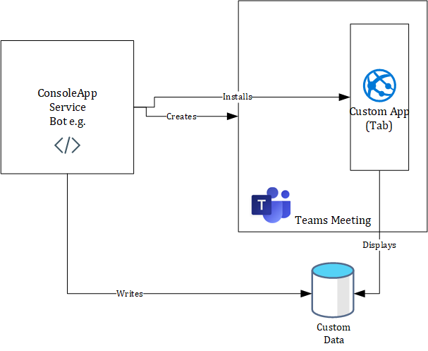
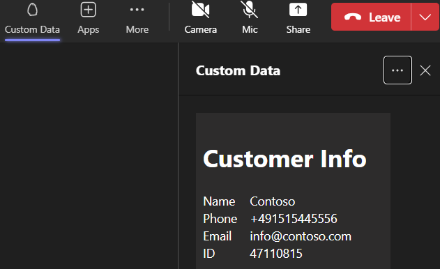

# tab-meeting-info-panel-node
A Microsoft Teams Tab displaying simple custom data in a meeting which can be installed by the parallel NodeJS console application.

## Summmary

This sample is a Microsoft Teams Tab displaying simple custom data in a meeting which can be installed by the parallel console application. Additionally at first the console application creates a meeting and also writes the custom data to a custom storage where it's later retrieved from the meeting app. 

High-level process



In meeting side-panel display



For further details see the author's [blog post](https://mmsharepoint.wordpress.com/2023/10/)

## Tools and Frameworks


For further details see the [Yo Teams documentation](https://github.com/PnP/generator-teams/docs)

## Prerequisites

* [Office 365 tenant](https://dev.office.com/sharepoint/docs/spfx/set-up-your-development-environment)
* [Node.js](https://nodejs.org) version 14.17.5 or higher
* [Gulp CLI](https://github.com/gulpjs/gulp-cli) `npm install gulp-cli --global`
* [ngrok](https://ngrok.com) or similar tunneling application is required for local testing

## Applies to

This sample was created [using the Yeoman Generator for Teams with Visual Studio Code](https://pnp.github.io/generator-teams/). 

## Version history

Version|Date|Author|Comments
-------|----|--------|--------
1.0|Oct xx, 2023|[Markus Moeller](http://www.twitter.com/moeller2_0)|Initial release

## Disclaimer

**THIS CODE IS PROVIDED *AS IS* WITHOUT WARRANTY OF ANY KIND, EITHER EXPRESS OR IMPLIED, INCLUDING ANY IMPLIED WARRANTIES OF FITNESS FOR A PARTICULAR PURPOSE, MERCHANTABILITY, OR NON-INFRINGEMENT.**

---

## Debug and test locally

To debug and test the solution locally you use the `serve` Gulp task. This will first build the app and then start a local web server on port 3007, where you can test your Tabs, Bots or other extensions. Also this command will rebuild the App if you change any file in the `/src` directory.

``` bash
gulp serve
```

To debug the code you can append the argument `debug` to the `serve` command as follows. This allows you to step through your code using your preferred code editor.

``` bash
gulp serve --debug
```


## Features
This is a Microsoft Teams Tab displaying simple custom data in a meeting which can be installed by the parallel console application.
* Use Microsoft Graph to create [Events](https://learn.microsoft.com/en-us/graph/api/user-post-events?view=graph-rest-1.0&tabs=http&WT.mc_id=M365-MVP-5004617) and install [Apps](https://learn.microsoft.com/en-us/graph/api/chat-post-installedapps?view=graph-rest-1.0&tabs=http&WT.mc_id=M365-MVP-5004617) in it
* Build a [Teams Tab Meeting app](https://learn.microsoft.com/en-us/microsoftteams/platform/apps-in-teams-meetings/build-tabs-for-meeting?tabs=desktop%2Cmeeting-chat-view-desktop%2Cmeeting-side-panel%2Cmeeting-stage-view-desktop%2Cchannel-meeting-desktop&WT.mc_id=M365-MVP-5004617)
* Using and authenticating with [Microsoft Graph JavaScript SDK](https://learn.microsoft.com/en-us/graph/sdks/sdks-overview?WT.mc_id=M365-MVP-5004617)
* Configuraton storage and retrieval in [Azure App Configuration](https://learn.microsoft.com/en-us/azure/azure-app-configuration/overview?WT.mc_id=M365-MVP-5004617)
* Data Storage and retrieval in [Azure Tables](https://learn.microsoft.com/en-us/javascript/api/overview/azure/data-tables-readme?view=azure-node-latest&WT.mc_id=M365-MVP-5004617)
